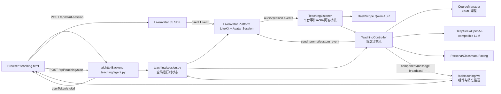
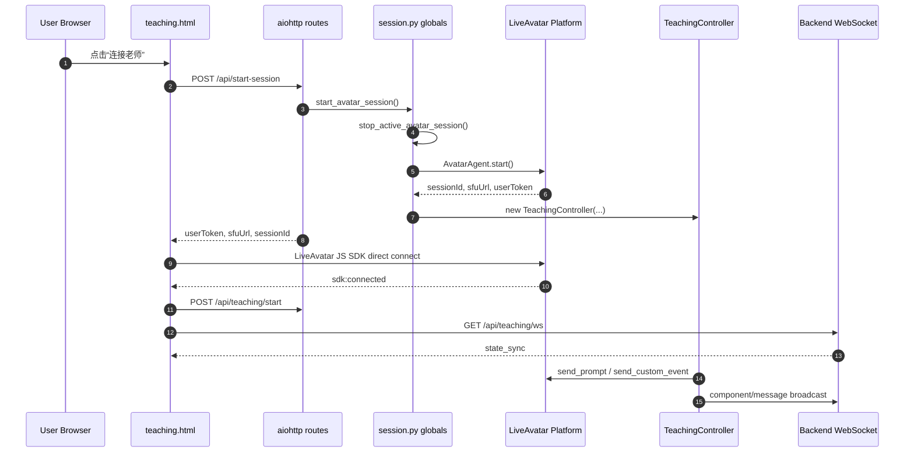
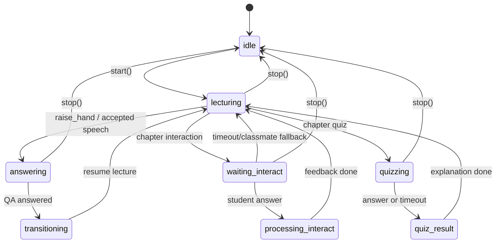
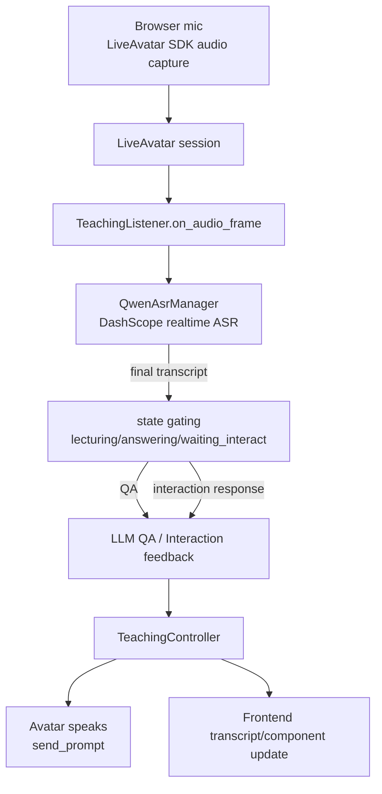
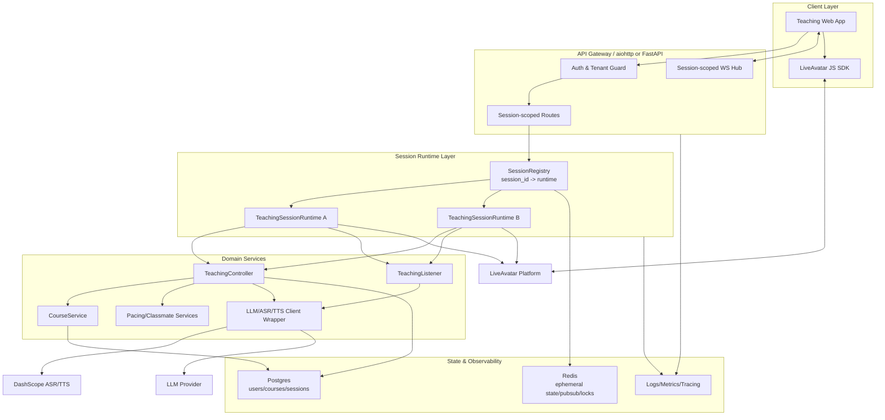
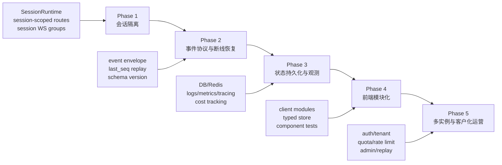

# Teaching Agent 架构梳理与生产化改造建议

## 目标与范围

本文基于当前 `teaching/` 代码和其引用的 `frontend/teaching.html`，梳理 Teaching Digital Human demo 的现有架构，并给出面向真实客户、多用户并发服务的优化方案。

当前结论先说清楚：这个项目已经具备完整 demo 链路，包括 LiveAvatar 连接、课程讲授、举手问答、ASR、LLM、AI 同学、白板组件和课程生成；但运行时设计仍是单进程单会话模型，不适合直接服务多个真实用户。

## 当前架构概览

### 主要模块职责

| 模块 | 当前职责 |
| --- | --- |
| `teaching/agent.py` | aiohttp 入口，注册 HTTP/WS 路由，启动/关闭 teaching runtime。 |
| `teaching/routes.py` | 处理连接、课堂控制、举手、答题、课程生成/选择、状态查询、前端资源和 WebSocket。 |
| `teaching/session.py` | 保存全局单例运行时对象，编排 LiveAvatar session、Controller、Listener、ASR、课程、同学和 WS 客户端集合。 |
| `teaching/teaching_controller.py` | 课堂主状态机，负责讲课循环、LLM 润色、测验、互动、AI 同学、组件推送、消息日志和 TTS idle 等待。 |
| `teaching/listener.py` | 接收 LiveAvatar 平台事件和音频帧，接入 Qwen ASR，根据课堂状态门控语音，处理学生问答和互动回答。 |
| `teaching/course_manager.py` | 加载并校验 YAML 课程。 |
| `teaching/course_generator.py` | 按主题和年龄段生成课程 YAML。 |
| `teaching/pacing_engine.py` | 根据课堂节奏决定继续、重讲、同学发言、提问或跳过。 |
| `teaching/classmate_engine.py` | 生成 AI 同学发言、测验猜测、互动回答和可选 TTS 音频。 |
| `frontend/teaching.html` | 单页课堂 UI，负责 LiveAvatar SDK 连接、麦克风、课程选择、WS/轮询、白板、测验、互动和对话记录。 |
| `frontend/teaching/whiteboard/*.js` | 各类交互白板 primitive 的渲染器。 |

## 当前关键链路

### 连接与开课时序

### 课堂状态机

### 音频、ASR、问答链路

## 当前设计问题

### 后端问题

1. **单例全局状态，无法多用户并发**

`session.py` 用 `_agent`、`_listener`、`_asr_manager`、`_controller`、`_course_manager`、`_session_info` 等模块级变量保存运行时。`start_avatar_session()` 会先调用 `stop_active_avatar_session()`，所以第二个用户连接会中断第一个用户。

2. **会话、课程和用户边界混在一起**

课程选择接口会直接修改 `sess._course_manager`、`sess._persona`、`sess._classmates`、`sess._pacing`、`sess._controller` 和 `teaching.config.COURSE_PATH`。这对 demo 简单有效，但在多用户环境中，一个用户选课会影响所有用户。

3. **Controller 职责过重**

`TeachingController` 同时处理课堂状态机、LLM 润色、AI 同学、测验、互动、TTS idle、消息日志、组件队列和前端推送。生产化后很难做隔离测试、故障恢复、限流和观测。

4. **内存队列和日志不可恢复**

组件队列、消息日志、断点、测验状态都在内存里。进程重启、实例扩缩容或用户刷新后，只能依赖有限的 `state_sync` 和最近内存队列恢复。

5. **WS 广播没有 session 过滤**

`_ws_clients` 是进程级集合，`ws_broadcast()` 会推给所有连接的 WS 客户端。当前单用户 demo 没问题，多用户时会串课、串消息、串测验。

6. **外部资源缺少生产级治理**

LLM、LiveAvatar、DashScope ASR/TTS 调用目前没有统一的超时、重试策略、熔断、配额、用户级限流和成本追踪。真实客户场景下，这会影响稳定性和成本可控性。

7. **缺少认证、授权和租户模型**

所有控制接口都默认同一个课堂，没有用户身份、课堂所有权、租户隔离或后台管理权限。

### 前端问题

1. **单 HTML 承担过多职责**

`frontend/teaching.html` 内联大量 CSS/JS，同时管理 SDK、麦克风、WS 重连、轮询 fallback、课程选择、状态渲染、测验、互动、音频队列和 transcript。维护和测试成本会快速上升。

2. **前端状态没有 session id 约束**

页面收到的 WS/component/status 都默认属于当前课堂，没有把 `sessionId` 或业务 `classroomSessionId` 贯穿到请求和事件处理里。多用户或多标签页时容易串状态。

3. **实时通道双路径复杂但缺少一致性协议**

WS 是主路径，轮询是 fallback，但两边都处理组件和消息。虽然有 `seq` 去重，但没有明确的事件版本、ack、补偿窗口和断线重放协议。

4. **组件协议缺少类型化契约**

白板、测验、互动、音频播放等 payload 依赖约定字段。随着 primitive 增多，前后端容易字段漂移。

5. **资源组织仍偏 demo**

核心 UI 在一个页面内，白板 primitive 虽然模块化，但整体还没有构建体系、路由、状态管理、错误边界、端到端埋点和组件测试。

## 面向多用户的目标架构

核心改造方向：从“进程内单例课堂”改成“每个用户/课堂一个隔离 Session Runtime”，并把可共享的课程配置、模型客户端、静态资源和观测能力抽出来。

### 推荐后端改造

| 优先级 | 改造项 | 建议 |
| --- | --- | --- |
| P0 | Session 隔离 | 新增 `TeachingSessionRuntime`，封装 agent、listener、asr、controller、course、persona、classmates、pacing、session_info。所有接口按 `session_id` 查 runtime。 |
| P0 | WS 按 session 分组 | `_ws_clients` 改为 `dict[session_id, set[ws]]`，所有 component/message/state_sync 必须带 `session_id` 并只发给对应连接。 |
| P0 | 课程选择用户化 | 课程选择不再改全局 `COURSE_PATH`，而是在创建 session 时确定 `course_id/course_name`，或允许 session 内切换并重建该 session runtime。 |
| P0 | API 路径改造 | 将 `/api/teaching/*` 迁移为 `/api/teaching/sessions/{session_id}/*`，兼容 demo 路由可保留一层 wrapper。 |
| P1 | 状态持久化 | 将 session 元数据、课程进度、消息日志、组件事件、测验结果写入 DB/Redis。内存只保留热状态。 |
| P1 | 事件协议 | 定义统一事件 envelope：`event_id`、`session_id`、`type`、`seq`、`timestamp`、`payload`、`schema_version`。支持断线后按 `last_seq` 补发。 |
| P1 | Controller 拆分 | 把 LLM 润色、Quiz、Interaction、Classmate、ComponentPublisher 拆成服务，Controller 保留状态转换和编排。 |
| P1 | 外部调用治理 | 对 LiveAvatar、LLM、ASR、TTS 增加统一 timeout、retry、circuit breaker、user/session 级限流、成本统计。 |
| P2 | 多实例部署 | 用 Redis pub/sub 或消息队列分发事件，保证 WS 节点和 session runtime 可以横向扩展。 |
| P2 | 管理后台能力 | 增加客户/租户、课程发布、session 回放、质量分析和人工接管入口。 |

### 推荐前端改造

| 优先级 | 改造项 | 建议 |
| --- | --- | --- |
| P0 | Session-aware client | 前端保存业务 `session_id`，所有 HTTP/WS 请求都带 session id；忽略不属于当前 session 的事件。 |
| P0 | 模块化拆分 | 将 `teaching.html` 拆成应用入口、LiveAvatarClient、TeachingApi、WsEventClient、ClassroomStore、QuizView、WhiteboardView、TranscriptView、CoursePicker。 |
| P1 | 类型化事件 | 用 TypeScript 或 JSON Schema 约束 component/message/state_sync payload，白板 primitive 也走 schema。 |
| P1 | 状态管理 | 引入轻量 store，所有 WS/轮询事件先归一化到 store，再由 UI 渲染，减少重复逻辑。 |
| P1 | 断线恢复 | WS 连接带 `last_seq`，后端补发缺失事件；轮询只作为恢复/降级通道，不重复实现完整业务逻辑。 |
| P2 | 前端工程化 | 使用 Vite/React/Vue 或保持 Vanilla 但引入构建、lint、单测、组件测试和 E2E 测试。 |
| P2 | 可观测体验 | 前端埋点连接耗时、ASR 延迟、TTS 等待、WS 重连、答题耗时、用户中断等指标。 |

## 分阶段落地计划

### 最小可行生产化切入点

第一步不建议大重写。最小可行改造是：

1. 引入 `TeachingSessionRuntime`，把当前 `session.py` 的全局变量先搬进 runtime 对象。
2. 新增 `SessionRegistry`，用 `session_id` 管理多个 runtime。
3. WS 客户端按 `session_id` 分组。
4. 前端保存并传递 `session_id`。
5. 课程选择只影响当前 session。

完成这一步后，项目才具备“同一进程内多个用户互不影响”的基础。之后再做持久化、横向扩展和前端工程化。

## 风险与注意事项

- LiveAvatar、DashScope ASR/TTS 和 LLM 都是有状态/高成本外部资源，多用户后必须先做配额和清理机制，避免用户关闭页面后 session 残留。
- 当前 Controller 里有不少异步 task 和 event，迁移到多 session 时要确保 stop/cancel/close 幂等，避免后台任务写入已关闭 session。
- 课程生成会写 YAML 文件，生产环境需要区分草稿、发布版本和租户权限，不能直接让所有用户共享同一个课程目录。
- 白板 primitive 数量已经不少，后续新增组件前应先固定 component schema，否则前后端联调成本会越来越高。
